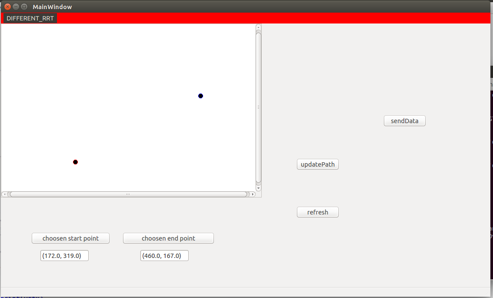

# Gui-PathPlanners
It helps anyone see paths drawn from different path planners and also tune the parameters
## Getting Started
### Pre-requisite
- python 2
- PyQt4
- Ros (Jade)
### Installing
1. Install PyQt4 `sudo apt-get install python-qt4`
2. Install [Ros(Jade)](http://wiki.ros.org/jade/Installation/Ubuntu)
3. Download/clone this repository

### Running
1. Go in the main folder of repo
2. run `catkin_make`
3. then source packages by running `source devel/setup.bash`
4. open 2 new terminals(2nd and 3rd terminal respectively) and repeat step 3 for 2nd terminal 
5. run `roscore` in the 3rd terminal
6. now run `rosrun gui_path gui` in 2nd terminal
7. Go to `src` folder of gui_path and run `python gui_path.py`

## Demo Screenshot

You will get this window.

### Working further
1. select any rrt from `rrt menu` in top left corner (for now only rrt-connect has been implemented)
2. select start point and end point by either clicking on window or by writing coordinates on text boxes
3. give different parameters(max_iter,bias,step_size)
4. click on `send data` then `update path`
5. you are done. you can repeat the steps(2 to 4) with changing paramters and input.
## planner screenshot

